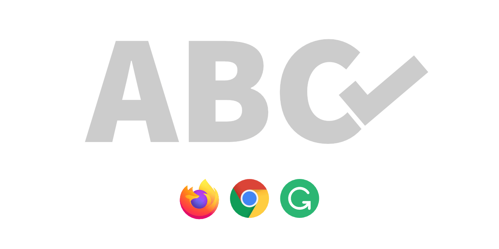

# Spellcheck Websites

- [About](#about)
- [How to use](#how-to-use)
- [How it works](#how-it-works)
- [Warnings](#warnings)
- [Todo](#todo)

 

---

  

## About

Enable browser + plugin spell checking ability within static website content elements.
This is different from basically all other spell checker tools, as they work _only_ with input forms or editable elements.

Here's the trick: This script sets _anything_ to be editable. This allows you to trigger spell checking in any element, even if they are dynamically loaded after the page is finished!

### Challenges

- You want an additional quality measure (e.g. this can be a great visual aid for external QA teams)
- Text is mixed with code and HTML markup
- You need more than just spell checking (e.g. tone of voice, context, synonyms)
- Native browser spell checking is not enough
- There is no backend interface, which would automatically benefit from browser and plugin spell checking

### When to use

- Fast in-page QA workflows (independent of code or access to original text documents)
- As additional measure to other quality measures

### Limitations

This script makes sense if you use plugins like 'Grammarly' (and others).
If you don't use them, there is no benefit from using this script.

### Alternatives

- Word like software
- Edit directly within spell checking tools

#### IDE solutions

##### VSCode

Great plugins that work with your code:

- [SpellChecker](https://marketplace.visualstudio.com/items?itemName=swyphcosmo.spellchecker)
- [Spell Right](https://marketplace.visualstudio.com/items?itemName=ban.spellright)

  

---

## How to use

### Prerequisites

- You know how to use browser plugins and can figure out the one we need.
- You have a spell checking plugin or want to install and use one.

### 1. Setup spell checking

Optional: If you don't already have one, install a language checking plugin like one of these:

- [Grammarly](https://app.grammarly.com/)
- [LanguageTool](https://languagetool.org/)

I've tested this script with these plugins. It probably works with more than just these.

**Important:** Go with a single solution!
Enabling multiple plugins simultaneously could lead to none of them working at all.

### 2. Setup script

1. Download the source code
2. Install the browser plugin [Tampermonkey](https://www.tampermonkey.net/)
3. Add a 'New userscript' in Tampermonkey and remove its default code
4. Copy the content of the JavaScript in the userscript
5. Edit the top-comment part and adjust the '@include' domains to your needs, e.g. like this:
`@include http://example.com/*`
  - The placeholder stands for any page on this domain
  - Make sure to correctly write 'http' or 'https' (if unsure, add both)

### 3. Use script

Before progressing: Make sure to read the [warnings](#warnings) section carefully!

1. Go to any of the websites you defined in the script
   - This is NOT intended to work with forms and backend editing tools!

  

---

## How it works

  

---

## Warning

